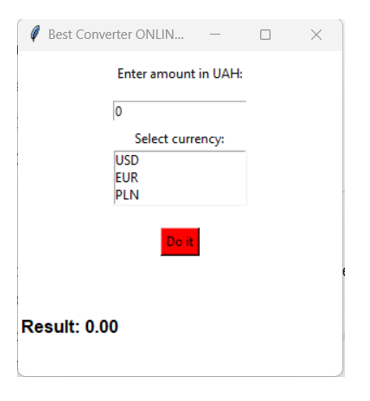

# 💰 Currency Converter (Best Converter FINAL)

Простий та зручний конвертер валют, написаний на Python з використанням графічної бібліотеки Tkinter. Дозволяє конвертувати суму з гривні (UAH) у USD, EUR або PLN.



## 📋 Функціонал
- 🔄 Конвертація гривні у популярні валюти.
- 🛡️ Захист від введення некоректних даних (літери, пусті поля).
- 🧪 Покриття автоматичними тестами (pytest).

## 🚀 Як запустити
Для запуску вам знадобиться встановлений Python 3.10+.

1. **Клонуйте репозиторій:**
   ```bash
   git clone [https://github.com/ВАШ_НІКНЕЙМ/PR2-Prizvyshche.git](https://github.com/ВАШ_НІКНЕЙМ/PR2-Prizvyshche.git)